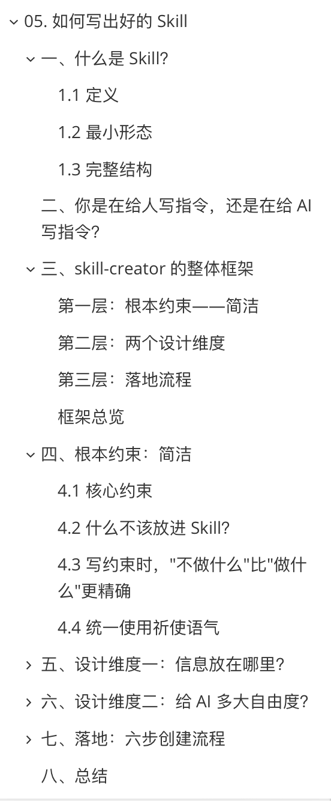
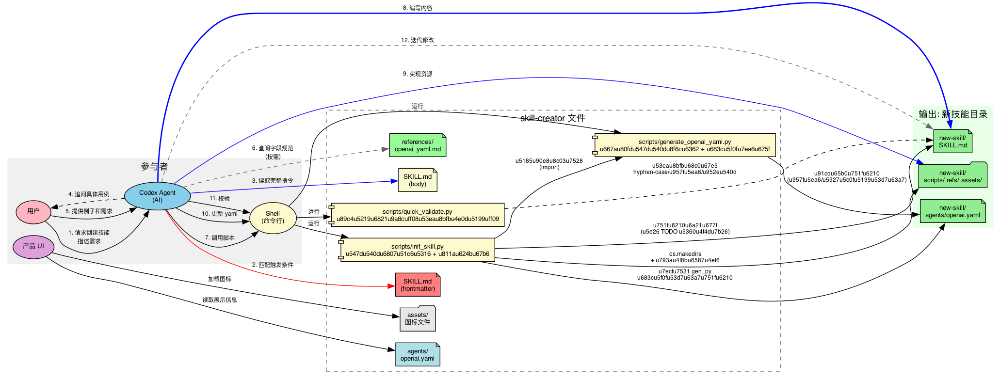

# 09 Skill 设计与 skill-creator 学习笔记

这一页承接前面的两条线：

- [07-两篇微信资料学习提要.md](./07-%E4%B8%A4%E7%AF%87%E5%BE%AE%E4%BF%A1%E8%B5%84%E6%96%99%E5%AD%A6%E4%B9%A0%E6%8F%90%E8%A6%81.md) 讲的是 `Codex / harness / skill` 为什么重要
- [08-中文开源教程与实战资源补充.md](./08-%E4%B8%AD%E6%96%87%E5%BC%80%E6%BA%90%E6%95%99%E7%A8%8B%E4%B8%8E%E5%AE%9E%E6%88%98%E8%B5%84%E6%BA%90%E8%A1%A5%E5%85%85.md) 讲的是这类外部教程应该怎么挂进学习导航

而这一页只做一件事：

- 把 `hello-agents` 里那篇 [Extra08-如何写出好的Skill.md](https://github.com/datawhalechina/hello-agents/blob/main/Extra-Chapter/Extra08-%E5%A6%82%E4%BD%95%E5%86%99%E5%87%BA%E5%A5%BD%E7%9A%84Skill.md) 单独整理成你自己以后能反复回看的 Skill 设计笔记

## 为什么值得单开一页

这篇内容不是普通“再给一个工具教程”。

它更像是在回答：

- Skill 到底是什么
- 为什么很多人写出来的 Skill 不稳定
- 写 Skill 时，什么该放正文，什么该放引用资源
- 什么时候该严格规定流程，什么时候该给 AI 自由度

换句话说，它不是在教你“填一个模版”，而是在教你怎么把一个 Skill 写成真正可触发、可执行、可迭代的 agent interface。

## 两张图先放这

### 目录图

这张图最有用的地方，是把文章重点压成了 4 个核心问题：

1. Skill 是什么
2. 你到底是在给人写说明，还是在给 AI 写运行约束
3. `skill-creator` 的整体框架长什么样
4. 怎么从原则走到落地流程

### 架构图

这张图对应的是更工程化的一层：

- 用户提需求
- Codex Agent 读取 Skill 指令
- Shell / 脚本做初始化、校验、生成
- 最终产出新的 Skill 目录、`SKILL.md`、`refs/assets/scripts` 和配置文件

也就是说，Skill 不只是“一段 prompt”，而是一个带结构、带资源、带流程的最小 agent packaging。

## 一、什么是 Skill

按这篇文章的思路，Skill 可以先这样理解：

- 它不是随手写的一段提示词
- 它是一个为特定任务准备的、能被 agent 触发的专项运行说明

更贴近你现在的上下文，可以把 Skill 想成：

- 给 Codex / Claude / agent runtime 的“小型任务手册”

### 最小形态

最小 Skill 至少要有两层意思：

- 什么时候该触发它
- 触发后该怎么做

如果连触发条件和动作都不清楚，Skill 就很容易变成：

- 写了很多字
- 但 agent 不知道什么时候该用
- 真用起来时也不知道先做什么

### 完整结构

从文章和你发的架构图看，完整 Skill 不只是一份 `SKILL.md`。

它往往会逐步长成：

- `SKILL.md`
- `references/` 或类似参考资料目录
- `assets/` 图片或静态资源
- `scripts/` 初始化、校验、生成脚本
- `agents/openai.yaml` 这类结构化配置

所以更准确地说：

- `SKILL.md` 是入口
- 资源、脚本、配置是它的支撑层

## 二、你是在给人写说明，还是在给 AI 写指令

这是这篇里最重要的一刀。

很多人写文档时默认对象是人，所以会习惯：

- 留一点语义弹性
- 省略自己觉得“很明显”的步骤
- 把背景和动作混在一起写

但写 Skill 时，目标对象首先是 AI。

这意味着：

- 触发边界要清楚
- 动作顺序要清楚
- 成功标准要清楚
- 不该做什么也要清楚

所以 Skill 写作更像：

- 写可执行约束

而不是：

- 写一篇“读起来挺懂”的说明文

## 三、`skill-creator` 的三层框架

从这篇结构来看，`skill-creator` 的骨架可以压成三层。

### 第一层：根本约束

最核心的约束是：

- 简洁

这里的“简洁”不是少写字，而是只把真正会改变行为的东西留在主说明里。

文章这部分最值得记住的点有 4 个：

1. Skill 主体应该只保留高价值约束。
2. 大段背景、长例子、静态资料不该都塞进主文件。
3. 写约束时，`不做什么` 常常比 `做什么` 更精确。
4. 语气最好统一成祈使句，减少歧义。

如果把这些翻译成你自己以后写 Skill 的习惯，就是：

- 主文件只放决策和动作
- 大块资料外置
- 优先写边界
- 统一命令口吻

### 第二层：两个设计维度

这篇把 Skill 设计拆成了两个很实用的问题。

#### 维度一：信息放在哪里

这其实是在做信息分层。

适合放在 `SKILL.md` 的：

- 触发条件
- 任务目标
- 核心步骤
- 成功 / 失败条件

适合放在 `references/`、`assets/`、脚本里的：

- 长表格
- 长示例
- 规范字段说明
- 静态背景知识
- 需要运行才能得到的内容

一句话记：

- `SKILL.md` 更像控制面
- 外部资源更像资料层和执行层

#### 维度二：给 AI 多大自由度

不是所有 Skill 都应该写得一样死。

更接近流水线任务的 Skill，应该：

- 步骤更明确
- 输出更固定
- 校验更严格

更接近研究、探索、创意生成的 Skill，应该：

- 保留一定策略空间
- 不把所有中间动作写死
- 只把关键约束钉牢

这件事很重要，因为很多 Skill 失败，不是因为“内容不够多”，而是因为：

- 对本来该固定的任务给了太多自由
- 对本来需要探索的任务又写得过死

## 四、根本约束里最值得拿走的 4 条

### 1. 简洁不是省略，而是去冗余

Skill 不是论文，也不是教程。

它首先要优化的是：

- 触发后行为是否稳定

不是：

- 文风是否完整

### 2. 不要把所有东西都塞进 Skill 主体

一个常见坏味道是：

- 把背景、术语、例子、规则、流程、边界全塞进一个 `SKILL.md`

这样会让主说明失焦。

更好的做法是：

- 把主文件当成路由器
- 把大块静态内容搬去引用资源

### 3. `不要做什么` 往往更有约束力

因为 AI 很容易在“差不多也算吧”的区域滑过去。

所以很多时候，与其写：

- 尽量简洁

不如写：

- 不要输出长篇背景介绍
- 不要在没有验证前直接下结论
- 不要重复抄写参考资料

### 4. 统一祈使语气

统一祈使语气的好处是：

- 动作边界更稳定
- agent 更容易把文本识别成操作规则

比如比起“你也许可以考虑”，更适合写成：

- 先确认目标，再执行脚本
- 失败时停止并汇报原因

## 五、落到你自己的仓库里，Skill 最好怎么分层

如果以后你自己写 Codex 风格 Skill，我会建议你优先按这套分层：

### `SKILL.md`

只放：

- 何时触发
- 目标是什么
- 默认流程
- 失败时怎么处理

### `references/`

放：

- 字段规范
- 风格规范
- 长例子
- 不常变的背景说明

### `assets/`

放：

- 图片
- 模板素材
- 结构示意图

### `scripts/`

放：

- 初始化脚本
- 校验脚本
- 生成脚本

### `agents/openai.yaml` 或同类配置

放：

- 需要结构化维护的 agent 配置项

这套分层和你发来的架构图是一致的，也很适合以后继续扩展。

## 六、一个更适合你现在的六步落地流程

文章原文讲的是“六步创建流程”，我把它改写成更适合你现在工作流的版本：

1. 先把 Skill 目标缩到足够窄。
2. 先写最小版 `SKILL.md`，只写触发条件和核心动作。
3. 把长资料挪去 `references/`，不要一开始就塞满主文件。
4. 明确哪些动作交给脚本，哪些动作交给 agent 自己判断。
5. 用 2 到 3 个真实提示词做 dry run，检查是否会正确触发。
6. 根据失败案例回改，优先补“边界”和“禁做项”。

这 6 步比“先写一份很完整的说明书”更稳，因为它本质上是在：

- 先做可用最小 Skill
- 再做行为收敛

## 七、这页和你现有仓库怎么接

这页最自然的连接方式是：

- `07` 负责讲 harness 思维
- `08` 负责讲外部教程地图
- `09` 负责讲自定义 Skill 该怎么写

也就是说，你现在这条学习线已经可以连起来了：

1. 先用 `07` 建立 `harness > 只是会调模型` 的视角
2. 用 `08` 找到值得跟进的中文资源
3. 用这一页把“自己写 Skill”变成可操作方法

## 八、如果你后面真要自己写 Skill，我建议先做哪几类

比起一上来写大而全的 Skill，更建议先从这几类开始：

1. 资料整理类：把一批教程或论文压成结构化学习笔记
2. 架构图生成类：围绕 `lanshu-animated-architecture-diagram` 做内容转图
3. 仓库导读类：读 README、目录、关键文件后产出导航
4. benchmark / harness 运行类：负责最小运行、日志整理、结果摘要

这些方向和你现在手上的仓库最贴，也最容易做出可复用的东西。

## 九、一句话压缩这篇 Extra08

如果只留一句话，我会记成：

- 好的 Skill 不是“写得多”，而是“触发清楚、边界清楚、主文件简洁、资源分层、自由度合适”。
